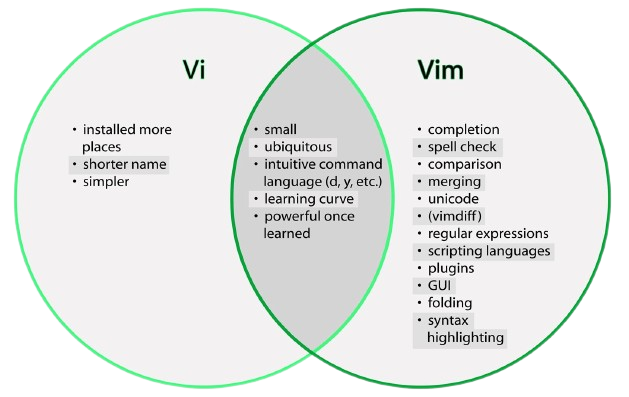
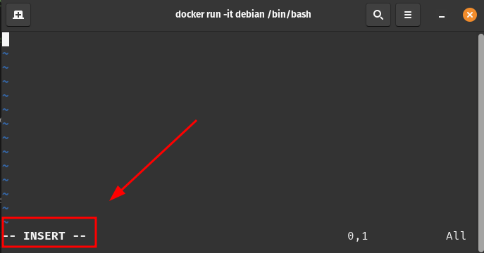

<!-- _class: lead invert -->
<!-- transition: cover -->

CyberPrez #03 - VIM
# Découvrir Vim 

---

# Sommaire
- Qu'est-ce que Vim?
    - [Comment quitter vim?](#4)
    - [Histoire de vim](#7)
---
<!-- transition: fade -->
<!-- _class: lead invert -->

# Qu'est-ce que Vim ?

Vim est un utilitaire en ligne de commande permettant de modifier des fichiers texte. Celui-ci est un dérivé de l'éditeur `vi`, qui est intégré dans la plupart des systèmes Unix-like.

---
 

Vim est connu pour être complexe à prendre en main, mais une fois que l'on a compris les bases, il est très puissant et permet de gagner beaucoup de temps.

Si vous avez trouvé cette présentation parce que **vous êtes bloqué dans vim** depuis plusieurs heures : *Respirez un bon coup*, pressez la touche `echap` et tapez `:q!` pour quitter sans sauvegarder.

*Si vous voulez sauvegarder avant de quitter le document, pressez la touche `echap`, puis `:wq`*

---
<!-- _class: lead invert -->

*Et maintenant que j'ai perdu 90% de mon audience, je peux commencer la réelle présentation.*

---
<!-- _class: lead invert -->

… mais avant ça, un peu d'histoire.

---
<!-- _class: lead invert -->

# 1. Histoire de vim

---
<!-- _header: '1. Histoire de Vim' -->
<!-- _class: lead invert -->

Vim, qui signifie **"Vi Improved"** *(Vi amélioré)*, est l'editeur de texte le plus utilisé en ligne de commande. Son histoire remonte aux années 1970 avec l'apparition d'un éditeur de texte appelé Vi *(Visual Editor)* développé par *Bill Joy* pour le système d'exploitation Unix.

Vi est devenu populaire parmi les programmeurs et les administrateurs système grâce à sa puissance et à sa simplicité d'utilisation en mode texte. Au fil des années, de nombreux utilisateurs ont contribué au développement de Vi en créant des versions personnalisées, chacune avec ses améliorations et fonctionnalités spécifiques.

---
<!-- _class: lead invert -->
<!-- _header: '1. Histoire de Vim' -->

En *1991*, *Bram Moolenaar* a créé Vim en se basant sur le code source de Vi. Vim était destiné à être une version améliorée de Vi, incorporant de nouvelles fonctionnalités et offrant une plus grande flexibilité.

 C'est lui 

---
<!-- _class: lead invert -->
<!-- _header: '1. Histoire de Vim' -->

Parmi les améliorations, on peut retrouver la coloration syntaxique, l'édition multifenêtres, le support des plugins et la possibilité d'étendre les fonctionnalités grâce à un langage de script interne.

Bref, il a repris la philosophie et la base de <code>vi</code>, et il en a fait un editeur incroyablement plus agréable et performant.

<!-- Source : https://null-byte.wonderhowto.com/how-to/intro-vim-unix-text-editor-every-hacker-should-be-familiar-with-0174674/ -->
---

<!-- _class: lead invert -->
<!-- _header: '1. Histoire de Vim' -->

Aujourd'hui, Vim continue d'évoluer grâce à une communauté active qui propose des mises à jour, des corrections de bugs et des fonctionnalités supplémentaires.

Il reste un outil essentiel pour les développeurs et les utilisateurs expérimentés qui apprécient sa puissance et sa capacité à optimiser leur flux de travail.

L'intégralité des donations vers Vim sont redirigées vers l'ICCF Holand pour aider des enfants en Ouganda.

Vous pouvez voter pour les futures fonctionnalitées de Vim après une donation.

---
<!-- _class: lead invert -->
<!-- transition: explode -->

Maintenant que le cours d'histoire est terminé, passons à la pratique.

---
<!-- _class: lead invert -->
<!-- transition: fade -->

# 2. La base de vim

---
<!-- _header: '2. La base de vim' -->

# 2. La base de vim

N'oubliez pas que VIM s'apprend avant-tout par la **pratique**. Il est donc conseillé de suivre cette présentation en même temps que vous lisez les slides.

**Ne désespérez pas.** Vous développerez des automatismes au fur et à mesure que vous l'utiliserez.

<!-- Source : https://www.freecodecamp.org/news/learn-linux-vim-basic-features-19134461ab85/ -->

---
<!-- _header: '2.1. Les modes' -->

## 2.1. Les modes

La première chose à savoir sur Vim, c'est qu'il existe plusieurs modes avec lesquels vous allez régulièrement permuter.

Chaque mode possède un rôle différent. Il est important de comprendre comment fonctionnent les modes pour pouvoir utiliser Vim correctement.

Nous utiliserons principalement 3 modes : le mode **normal**, le mode **insertion** et le mode **visuel**.

- Le mode **normal** est celui par défaut, il permet de lancer des 'macros' et des 'commandes'.
- Le mode **insertion** peut se lancer en pressant '`i`' afin d'éditer un texte sans raccourcis.
- Le mode **visuel** s'active en appuyant sur '`v`', il permet de modifier une sélection.

---
<!-- _header: '2.1. Les modes' -->
<!-- _footer: '' -->

Le mode dans lequel nous nous trouvons est indiqué en bas à gauche de l'écran. Si vous êtes en mode **insertion**, vous devriez voir `-- INSERT --` en bas à gauche de l'écran.

Le mode **visuel** sera affiché de la même manière, avec `-- VISUAL --`.

Vous pouvez **toujours** revenir au mode `normal` en pressant la touche `echap`.

---

Téléchargez maintenant le fichier exemple `cigale-et-la-fourmi.txt` [ici](./exercices/cigale-et-la-fourmi.txt).

Pour l'ouvrir avec vim, tapez `vim cigale-et-la-fourmi.txt` dans votre terminal ou tapez `vim` puis écrivez `:open cigale-et-la-fourmi.txt`.

---
<!-- _header: '2.2. Les déplacements' -->

## Apprenons à se déplacer dans un fichier
À l'origine, les touches directionnelles n'existaient pas. Pour se déplacer dans le texte, il fallait utiliser les touches `h`, `j`, `k` et `l` pour se déplacer respectivement à gauche, en bas, en haut et à droite.

Vim a gardé cette logique, mais il est *(heureusement)* possible d'utiliser les touches directionnelles pour se déplacer.

--- 
<!-- _header: '2.3. Mise en pratique - Insertion' -->

Dans le fichier `cigale-et-la-fourmi.txt`, placez votre curseur sur la première ligne du texte, entrez en mode **insertion** en pressant `i` et écrivez `La Cigale et la Fourmi` puis appuyez sur `echap` pour revenir en mode **normal**. L'objectif est d'ajouter le titre en début de fichier.

<video style="center" src="videos/mode-i.mp4" controls width="80%"></video>

---
<!-- _header: '2.3. Mise en pratique - Insertion' -->

Simple ? Une fois de retour en mode **normal**, enregistrez le fichier en pressant `:w` puis `entrée`.

<video style="center" src="videos/save.mp4" controls width="60%"></video>

Pour quitter vim, `:q` puis `entrée`.

Pour **enregistrer et quitter**, combinez les deux raccourcis précédents : `:wq` puis `entrée`.

---
<!-- _header: '' -->

Bien que le mode **insertion** permette d'ajouter/supprimer du texte. Nous n'allons pas basculer en **insertion** à chaque fois que nous voulons supprimer une section, ce serait __**overkill**__.

---
<!-- _header: '2.4. Rester en mode normal' -->
<!-- _class: lead invert -->

Nous allons alors apprendre quelques raccourcis du mode normal pour nous éviter de constamment changer de mode.

---
<!-- _class: lead invert -->

Les deux principales manières de supprimer du texte sont `x` et `d` :
- `x` supprime le caractère sous le curseur.
- `d` supprime une chaine de caractères définie par un paramètre.

---
Il est également possible de répéter une action en ajoutant un nombre avant la commande. Par exemple, `5x` supprimera les 5 caractères suivants le curseur.

<video style="center" src="videos/x.mp4" controls width="80%"></video>

---
<!-- _class: lead invert -->

Mais avant d'apprendre à supprimer via `d`. Nous allons d'abord **apprendre à nous déplacer de manière efficace**.

---
<!-- _header: '2.5. Se déplacer dans Vim' -->

En mode **normal**, en pressant `0` ou `^`, le curseur se positionne en début de ligne. 

- `gg`, au début du fichier
- `G`, à la fin du fichier
- `w`, au début du prochain mot
- `e`, à la fin du mot actuel/suivant
- `b`, au début du mot précédent/actuel 
- `:10` ou `10G`, à la ligne 10

Ces mêmes commandes peuvent servir de paramètre, comme pour l'action `d`*(delete)*.

Essayez alors de supprimer des mots via `dw`, `de` et `db`.

Idem, pour des lignes entières : `d$`, `d0`, ou `dd`

---
<!-- _header: '2.6. Apprendre à supprimer' -->
 

l'instruction `d` est également disponible en tant que commandes *(commençant par `:`)*. Pour `d`, la syntaxe est `:[debut],[fin]d`. 

Exemple :
- `:5,10d` va tout supprimer entre les lignes 5 et 10

à retenir qu'il existe certains caractères spéciaux pour définir le début et la fin :
- `.`  → La ligne du curseur
- `＄` → la dernière ligne
- `%`  → toutes les lignes

---
<!-- _class: lead invert -->

Si vous voulez annuler une action, utilisez `u`*(undo)*.

---
<!-- _header: '1. Exercice' -->
 

Vous savez vous déplacer, supprimer des blocs et refaire une action.

Comme exercice, ouvrez de nouveau `la-cigale-et-la-fourmi.txt`,

- Placez-vous à la 5ème ligne.
- Placez-vous sur ***b**ise* avec une seule action
- Supprimez le *la* en une seule action.
- Supprimez *bise fut* en une seule action. *(répétitions autorisées)*
- Placez-vous à la ligne 10 en une seule action.
- Supprimez les 2 lignes **suivantes** en une seule action.
- Supprimez les 5 lignes **précédentes** en une seule action.

 Rappel: Une répétition est un chiffre X à mettre devant une commande pour qu'elle se répète X fois. 

---

# Correction

<video style="center" src="videos/exercice-suppr.mp4" controls width="80%"></video>

---
<!-- _class: lead invert -->

D'autres macros/actions en vrac : 
- `r` → remplace le caractère sous le curseur
- `a` → entre en mode insertion après le curseur
- `:.,$-3d` → supprime toutes les lignes entre la ligne du curseur et les 3 dernières lignes du fichier.
- `o` → entre en mode insertion en créant une nouvelle ligne.
- `O` → entre en mode insertion en créant une nouvelle ligne au-dessus.

---
<!-- _class: lead invert -->

# Passer en visuel

---
<!-- _header: '3.1. Le mode visuel' -->

Le mode **visuel** est le seul que nous n'avons pas encore abordé. Il permet de sélectionner du texte et y appliquer une macro.

En mode **normal**, appuyez sur `v` pour entrer en mode **visuel**. Vous pouvez alors vous déplacer avec les touches directionnelles pour sélectionner du texte.

---

Une fois le texte sélectionné, vous pouvez appliquer une macro comme `d` pour couper le texte sélectionné.

:eyes: Car oui, je vous ai menti ! `d` ne permet pas de **supprimer** mais de **couper**. La différence est que le texte coupé est stocké dans un presse-papier *(clipboard)*.

 C'est l'équivalent total d'un <code>ctrl+x</code>. 

---
<!-- _class: lead invert -->

En supprimant du texte, il est possible de le coller avec `p` *(paste)* ou `P` pour le coller avant le curseur.

---

Comme vu dans la précédente animation, il est possible de continuer à utiliser les raccourcis de déplacement en mode **visuel**.

*Vous pouvez aussi directement sélectionner la ligne entière avec `V`*.

Pour copier une sélection, utilisez `y` *(yank)*.

<video style="center" src="videos/copy-paste.mp4" controls width="70%"></video>

---
<!-- _class: lead invert -->

Le *clipboard* de Vim est utilisable entre différents fichiers. C'est-à-dire que vous pouvez copier du texte dans un fichier, puis le coller dans un autre fichier.

<video style="center" src="videos/copy-entre-fichiers.mp4" controls width="80%"></video>

---

